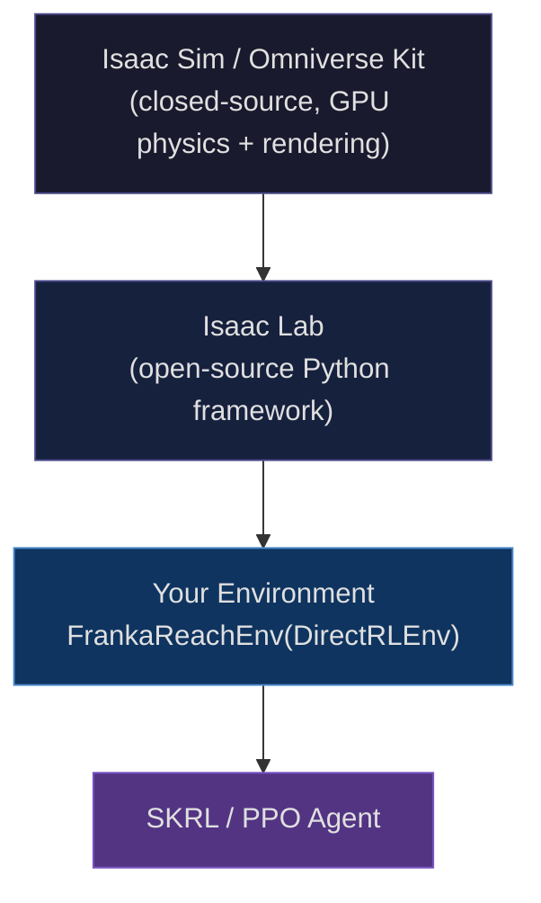
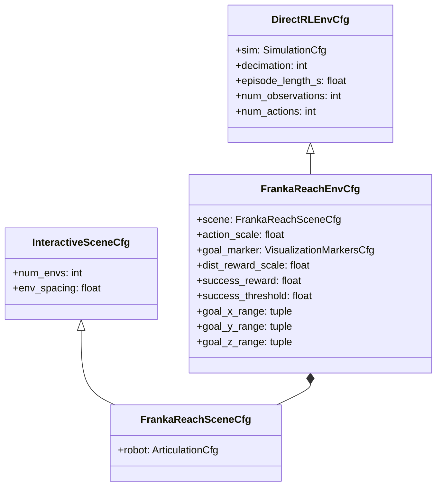
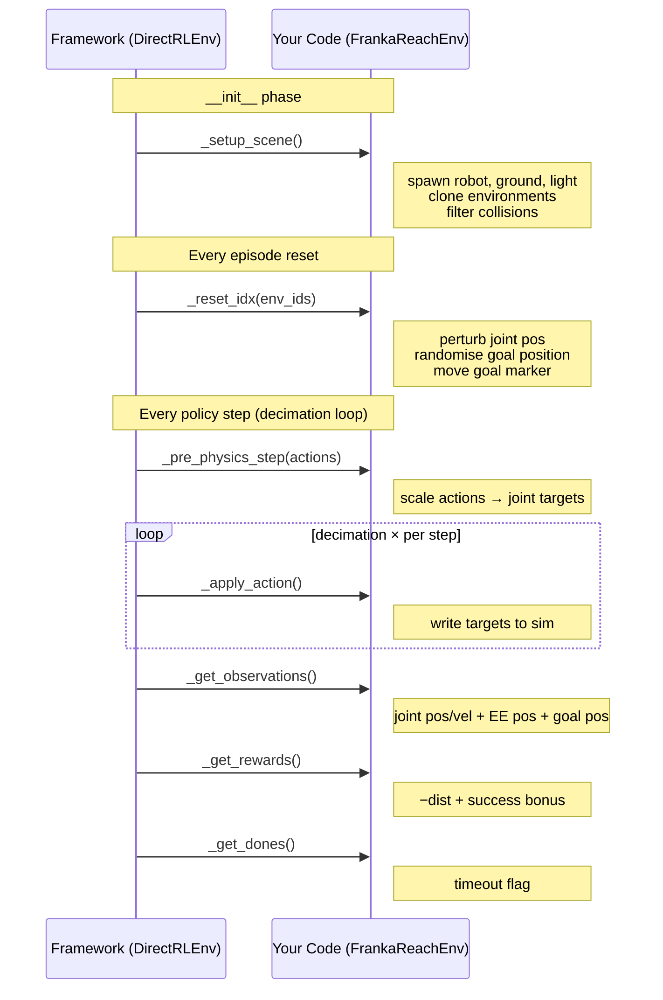

# Example 08: Custom Direct RL Environment — Franka Reach

## Goal

Stop using pre-built environments and **write one from scratch**.

Every previous example called `gym.make("SomeName-v0")` and treated the
environment as a black box. Here we author the black box itself: we define
the scene, the physics assets, the reward signal, the observation vector, and
the reset logic. The PPO agent is unchanged.

---

## Files

| File | What it contains |
|---|---|
| `env_cfg.py` | Two `@configclass` dataclasses — scene layout and task parameters |
| `reach_env.py` | `FrankaReachEnv` — the full `DirectRLEnv` subclass |
| `train.py` | AppLauncher bootstrap → instantiate env → train PPO |
| `eval.py` | Load checkpoint → deterministic rollout → print return stats |

---

## The Task

A Franka Panda arm must move its end-effector (the wrist link `panda_hand`)
to a randomly placed goal position shown as a green sphere. The agent only
sees joint state and goal position — no camera, no image, no CNN.

```
┌────────────────────────────────────────────────────┐
│  Episode start                                     │
│  • Robot: home pose + small random joint noise     │
│  • Goal: uniform sample inside reachable workspace │
│                                                    │
│  Each step (30 Hz control)                         │
│  • Policy outputs 7 joint-position deltas          │
│  • Reward = −‖EE − goal‖  +  10 × (dist < 5 cm)   │
│                                                    │
│  Episode end: 5-second timeout (150 steps)         │
└────────────────────────────────────────────────────┘
```

---

## IsaacLab Framework Overview

Isaac Lab is layered on top of NVIDIA Isaac Sim (Omniverse).  
Understanding three layers is enough to write your own environments:



**Isaac Sim** owns the physics engine, the USD stage, and GPU-side rigid body
simulation. You never touch it directly.

**Isaac Lab** provides:
- `DirectRLEnv` — base class that wires physics steps into the RL loop
- `InteractiveSceneCfg` / `InteractiveScene` — declarative asset management + parallel-env cloning
- `Articulation` — high-level handle to a robot (reads joint states, writes targets)
- `@configclass` — dataclass decorator that makes configs composable and overridable

**Your env** overrides six methods (see below) and inherits everything else.

---

## The Two Config Classes



The `@configclass` decorator makes every field overridable without subclassing:

```python
cfg = FrankaReachEnvCfg()
cfg.scene.num_envs = 512         # fewer envs on a smaller GPU
cfg.success_threshold = 0.03     # tighter goal
cfg.episode_length_s  = 8.0      # longer episodes
```

---

## The Six Methods You Must Implement

`DirectRLEnv` is an abstract base class that calls these six hooks in a fixed
order.  You fill them in; the framework handles the rest (Gymnasium spaces,
tensorboard logging, parallel resets, etc.).



### `_setup_scene` — build the world

```python
def _setup_scene(self) -> None:
    self.robot = Articulation(self.cfg.scene.robot)     # read USD, init joints
    self.scene.articulations["robot"] = self.robot      # register for cloning

    sim_utils.GroundPlaneCfg().func("/World/defaultGroundPlane", ...)
    sim_utils.DomeLightCfg(...).func("/World/DomeLight", ...)

    self.scene.clone_environments(copy_from_source=False)
    self.scene.filter_collisions(global_prim_paths=[])
```

`clone_environments` replicates everything inside `{ENV_REGEX_NS}` across the
grid. Assets at absolute paths (`/World/...`) are shared and NOT cloned.

### `_pre_physics_step` — apply actions

```python
def _pre_physics_step(self, actions: torch.Tensor) -> None:
    targets = self._default_arm_pos + self.cfg.action_scale * actions.clamp(-1, 1)
    targets = targets.clamp(self._joint_lower, self._joint_upper)
    self.robot.set_joint_position_target(targets, joint_ids=self._arm_joint_ids)
```

Actions are normalised joint-position **deltas**.  Adding them to the home
pose and clamping to joint limits keeps the arm in a safe operating range.

### `_get_observations` — what the policy sees

```
obs = [ joint_pos(7) | joint_vel(7) | ee_pos_local(3) | goal_pos_local(3) ]
                                                              total: 20 dims
```

Both EE and goal positions are expressed relative to the robot's base link.
This makes the 20-dim vector independent of which grid slot the env occupies.

### `_get_rewards` — the learning signal

$$r = \underbrace{\lambda \cdot \|p_{EE} - p_{goal}\|}_{\text{dense distance penalty}} + \underbrace{R_s \cdot \mathbf{1}[\|p_{EE} - p_{goal}\| < \tau]}_{\text{success bonus}}$$

| Symbol | Value | Meaning |
|---|---|---|
| $\lambda$ | −1.0 | `dist_reward_scale` |
| $R_s$ | 10.0 | `success_reward` |
| $\tau$ | 0.05 m | `success_threshold` |

The dense term gives a gradient everywhere; the discrete bonus accelerates
convergence once the arm is in the neighbourhood of the goal.

---

## Parallel Environments

Isaac Lab runs all environments **in a single GPU physics scene**, not as
separate processes.  The cloner lays them out on a grid:

```
  env_0      env_1      env_2      env_3
  /World/envs/env_0/Robot
             /World/envs/env_1/Robot
                        /World/envs/env_2/Robot ...

  ← env_spacing = 2.5 m →
```

All robot tensors are shaped `(num_envs, ...)`.  Indexing with `env_ids` in
`_reset_idx` resets only the finished environments without touching the rest.

---

## Decimation: Policy Hz vs Physics Hz

```
Physics sim:  120 Hz  (dt = 1/120 s)
Policy:        30 Hz  (decimation = 4)

  physics step 1 ─┐
  physics step 2   ├─ _apply_action() called each sub-step
  physics step 3   │   (targets stay constant during decimation)
  physics step 4 ─┘
        ↓
  _get_observations()   ← called once, after all 4 sub-steps
  _get_rewards()
  _get_dones()
```

Higher decimation = smoother motion at the cost of a longer effective horizon.

---

## Observation vs Action Space

| | This example (08) | Previous (07) |
|---|---|---|
| **Obs type** | Proprioceptive vector | RGB image |
| **Obs shape** | `(20,)` | `(H, W, 3)` |
| **Policy arch** | `MLPGaussianPolicy` | `CNNGaussianPolicy` |
| **Action** | 7 joint pos deltas | Continuous box |
| **Env source** | Custom `DirectRLEnv` | Pre-registered gym ID |

The PPO agent configuration is **identical** in both examples. Only the model
class and the environment changed — the agent doesn't know or care.

---

## Running

```bash
# Train (4096 envs by default — needs ~12 GB GPU RAM)
python examples/08_custom_reach/train.py --timesteps 500000

# Train on a smaller GPU
python examples/08_custom_reach/train.py --timesteps 500000 --num-envs 512

# Resume from checkpoint
python examples/08_custom_reach/train.py --checkpoint runs/08_custom_reach/.../agent.pt

# Evaluate
python examples/08_custom_reach/eval.py --checkpoint runs/08_custom_reach/.../agent.pt --episodes 20

# Watch live in browser (WebRTC)
python examples/08_custom_reach/train.py --livestream 2
```

---

## Things to Experiment With

| Experiment | What to change |
|---|---|
| Tighter goal | `success_threshold = 0.02` |
| Sparse reward only | `dist_reward_scale = 0.0`, `success_reward = 100.0` |
| Add velocity penalty | `_get_rewards`: subtract `joint_vel.norm()` |
| Wider workspace | expand `goal_x/y/z_range` |
| Faster arm | `action_scale = 1.0` |
| Add orientation | extend obs with EE quaternion → `num_observations = 24` |
| Domain randomisation | randomise `action_scale` or joint damping in `_reset_idx` |
